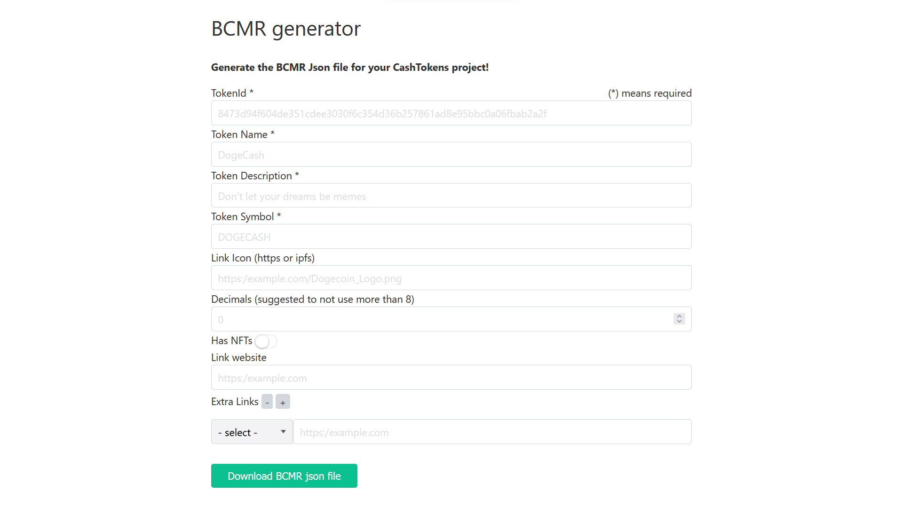

# BCMR Generator

Fill-in form to create the BCMR Json file for a CashTokens project! Deployed at [bcmr-generator.netlify.app](https://bcmr-generator.netlify.app/).

This Json file can then be hosted on the web on a domain name you control or can be pinned on IPFS.



## Project Setup

```sh
yarn
```

### Run Locally

```sh
yarn dev
```

## Historic Version

🪦 Before moving the generator to Vue it was written in vanilla-js. <br>
You can find the old codebase [here](https://github.com/mr-zwets/bcmr-generator-vanillaJS).

